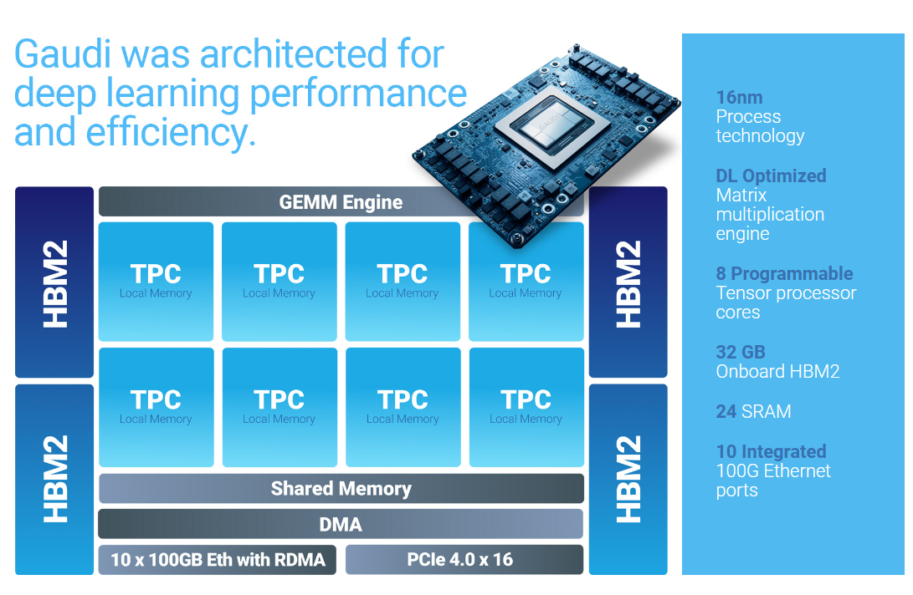

<div align="center">
  
</div>


<!-- @import "[TOC]" {cmd="toc" depthFrom=1 depthTo=6 orderedList=false} -->

<!-- code_chunk_output -->

- [Habana](#habana)
  - [Product Specs](#product-specs)
- [Models supported](#models-supported)
- [How to run](#how-to-run)
  - [Install Habana release](#install-habana-release)
  - [Run byte-mlperf task](#run-byte-mlperf-task)

<!-- /code_chunk_output -->


# Habana

As enterprises and organizations look to seize the growing advantages of AI, the time has never been better for AI compute that’s faster yet efficient. Efficient on cost, power, and your time and resources. That’s why you’ll want to give Habana Gaudi processors a try.The Gaudi acceleration platform was conceived and architected to address training and inference demands of large-scale era AI, providing enterprises and organizations with high-performance, high-efficiency deep learning compute.

## Product Specs

- Gaudi

With Habana’s first-generation Gaudi deep learning processor, customers benefit from the most cost-effective, high-performance training and inference alternative to comparable GPUs. This is the deep learning architecture that enables AWS to deliver up to 40% better price/performance training with its Gaudi-based DL1 instances—as compared to comparable Nvidia GPU-based instances. Gaudi’s efficient architecture also enables Supermicro to provide customers with equally significant price performance advantage over GPU-based servers with the Supermicro X12 Gaudi Training Server.

<div align="center">
  
</div>

- Gaudi2

Our Gaudi2 accelerator is driving improved deep learning price-performance
and operational efficiency for training and running state-of-the-art models, from the largest language and multi-modal models to more basic computer vision and NLP models. Designed for efficient scalability—whether in the cloud or in your data center, Gaudi2 brings the AI industry the choice it needs—now more than ever.

<div align="center">
  
</div>

# Models supported

| Model name |  Precision | QPS | Dataset | Metric name | Metric value | report |
| ---- | ---- | ---- | ---- | ---- | ---- | ---- |
| gpt2 | BF16 | N/A | N/A | N/A | N/A | N/A |

# How to run

## Install Habana release

Refer [link](https://docs.habana.ai/en/latest/Installation_Guide/) describe how to obtain and install SynapseAI and Gaudi drivers either on Amazon EC2 DL1 instances or on-premise environments, docker images as well as TensorFlow and PyTorch frameworks.

## Run byte-mlperf task

For example,

```bash
python3 launch.py --task widedeep-tf-fp32 --hardware HPU
```

For more information of the command to run the task, please refer to [ByteMLPerf](../../../README.md#usage).
